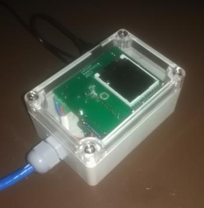

# KilnRegulator3.0

## Vous en avez marre d'acheter des régulateurs de four tout droit sortit des années 80 à un prix exhorbitant ? 

## Vous avez envie de pouvoir suivre votre cuisson en temps réel ?

## Vous voulez programmer votre cuisson depuis une interface conviviale ?

## c'est possible grâce au projet [open source KilnRegulator3.0](https://github.com/jdeantoni/KilnRegulator3.0)

Ce projet a été initié par Julien Deantoni et deux ingénieurs (étudiants à l'époque): Guillaume Cassagrande et Pierre Emmanuel Novas.
L'idée de départ est de mettre au gout du jour les technologies obsolètes utilisées par la majorité des vendeurs de programmateurs de fours céramiques. Nous proposons donc un régulateur qui se branche sur les prises classiques des fours de type ceradel ou solargil et qui communique avec une application permettant de programmer le four et de voir le suivi de cuisson; le tout pour un prix de revient autour de 70€ (et quelques heures de travail) si vous fabriquez tout vous même.

### Une video explicatif du projet initial se trouve [ici](https://youtu.be/vaViCxbbG_A)
<iframe width="560" height="315" src="https://www.youtube.com/embed/vaViCxbbG_A" frameborder="0" allow="autoplay; encrypted-media" allowfullscreen></iframe>

### Noter que le boitié à bien évolué depuis ;):

