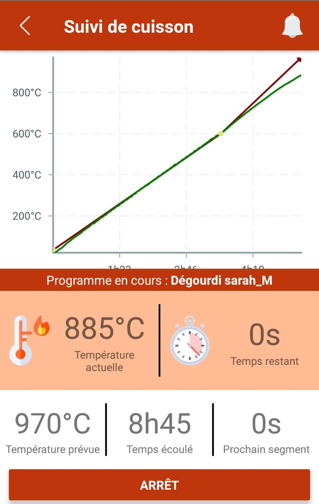
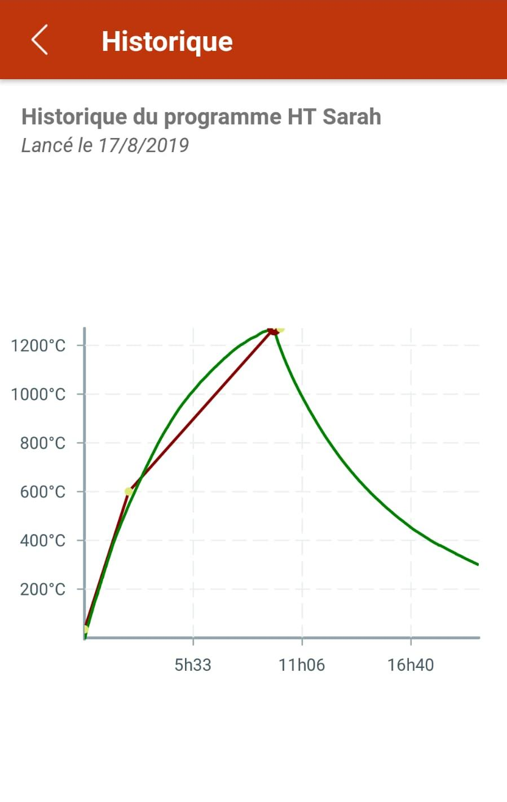

# KilnRegulator3.0

## Vous en avez marre d'acheter des régulateurs de four tout droit sortit des années 80 à un prix exhorbitant ? 

## Vous avez envie de pouvoir suivre votre cuisson en temps réel ?

## Vous voulez programmer votre cuisson depuis une interface conviviale ?

